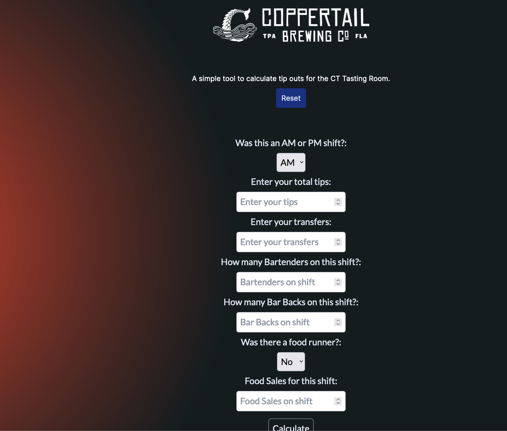

# Coppertail Brewing Tip Out Calculator

## Description 
A simple tip out calculator built specifically for the Coppertail Tasting Room staff. 

---

 ## Table of Contents:
  - [Information](#information)
  - [Contact Information](#contact-information)
  - [License](#license)
  - [Contributions](#contributions)
  - [Links](#links)
  - [Repo](#repo)

## Information

This tip out calculatory was crafted by incorporating Coppertail Brewing Tasting Room's tip-out policy and procedures. It seamlessly integrates the percentage allocations, allowing staff members to effortlessly and expeditiously calculate their daily tip-outs with utmost efficiency. This app ensures an enhanced experience for the dedicated team at Coppertail Brewing Tasting Room.

Feel free to reach out for more information!

---

## Contact Information

Email: zeus.cordeiro@gmail.com

LinkedIn: https://www.linkedin.com/in/zeus-cordeiro/

## License

N/A

## Contributions

All contributions were done by [Zeus Cordeiro](https://github.com/Zcordeiro)

## Screenshot of finished page

---

# LINKS

## Link to Published Page

https://ct-tip-out-calc.vercel.app/

## Repo

https://github.com/Zcordeiro/CT-Tip-Out-Calc
